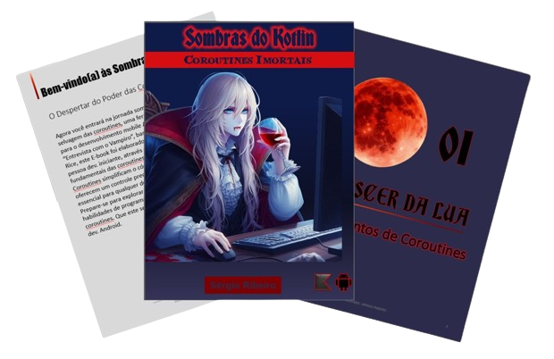

    

-------

# Projeto EBOOK Gerado com ajuda de I.A.s

Projeto com o objetivo de gerar um ebook digital com as facilidades das ferramentas de IA, produzido durante curso da [DIO](https://dio.me). todos os prompts
seguem abaixo.

<a href="https://github.com/SergioRiosRibeiro/ebook-creation/blob/main/Coroutines%20Imortais.pdf" title="View PDF now"> 📕Clique aqui para ler</a>

## 💻 Tecnologias utilizadas no projeto

- [ChatGPT](https://chat.openai.com/) 
- [Lexica.art](https://lexica.art/)
- [Copilot](https://www.bing.com/chat?form=NTPCHB)
- [RemoveBg](https://www.remove.bg/)
- [PowerPoint](https://www.microsoft.com/en/microsoft-365/powerpoint)

## 🧠 Prompts

ChatGPT：

|   Ação   | prompt                                                                                                                                                                                                                                                                         |
| :------: | ------------------------------------------------------------------------------------------------------------------------------------------------------------------------------------------------------------------------------------------------------------------------------ |
|  título  | Escreva um título de um ebook sobre o tema de Kotlin. O ebook é do nicho de programação e o subnicho é de uso de kotlin para o desenvolvimento android. O título deve ser épico e curto e ter uma temática de vampiros (com base nas obras das crônicas vampirescas da autora Anne Rice). Me liste 5 variações de títulos |
| capítulos | Boa tarde GPT, tudo bem com você? Por favor, considerando um ebook de título "Sombras de Kotlin - Corroutines Imortais", com temática de vampiros programando para android usando kotlin, me sugira nomes de quatro capítulos para este ebook. Os capítulos devem ser divididos entre os conteúdos mais importantes para se saber sobre coroutines em desenvolvimento mobile com kotlin e devem ser escritos considerando que essa é uma mídia para desenvolvedores iniciantes |
| conteúdo | Faça um texto para ebook, com foco em android usando kotlin, atendendo as regras abaixo {REGRAS} > Máximo de 6 linhas por parágrafo, usando fonte Calibri tamanho 24. > Máximo de dois parágrafo por página, considerando que cada capítulo terá 3 páginas. > Explique sempre de maneira simples > Deixe o texto enxuto > Sempre traga pelo menos um exemplo de códigos em contextos reais para cada capítulo > Faça isso em cada capítulo, sendo os capítulos os logo abaixo: - "O Nascer da Lua - Fundamentos de Coroutines" - Aqui você deve fazer uma breve introdução aos conceitos básicos de coroutines, suas vantagens e como elas diferem das abordagens tradicionais de programação assíncrona. - "O Chamado Sombrio - Funções Suspensas" - Aqui você deve explorar funções suspensas, incluindo a criação e uso em projetos Android, com exemplos simples e claros para iniciantes. - "O Ritmo das Trevas - Controle e Sincronização": - Aqui você deve ensinar como controlar o fluxo de execução das coroutines, incluindo o uso de withContext, yield, e join. - "A Noite Silenciosa - Cancelamento e Exceções": - Aqui você deve focar em como cancelar coroutines de maneira eficiente e lidar com exceções, garantindo que o código seja seguro e confiável. |

Lexica：

|  Ação  | prompt                                                                                 |
| :----: | -------------------------------------------------------------------------------------- |
| Cap.1 | red full moon                                                                          |
| Cap.2 | vampire walking at night |
| Cap.3 | vampire floating |
| Cap.4 | vampire playing piano |
| Cap.5 | silent walk at nigh |

Copilot：

|  Ação  | prompt                                                                                 |
| :----: | -------------------------------------------------------------------------------------- |
| capa   | generate a long blond hair vampire using a computer and drinking blood from a goblet   |
| conclusão | generate a vampire biting someone's neck |
| agradecimentos | generate a vampire saying goodbye |

## ✨ Features

- Conteúdo gerado via ChatGPT
- Imagens geradas via Lexica e Copilot

## 👨‍💻 Criador

    
    
&nbsp&nbsp&nbspSérgio R. Ribeiro 
    &nbsp&nbsp&nbsp
    <a href="https://github.com/SergioRiosRibeiro">
    GitHub</a>&nbsp;|&nbsp;
    <a href="https://www.linkedin.com/in/sergio-rios-ribeiro/">LinkedIn</a>
&nbsp;
  

---
